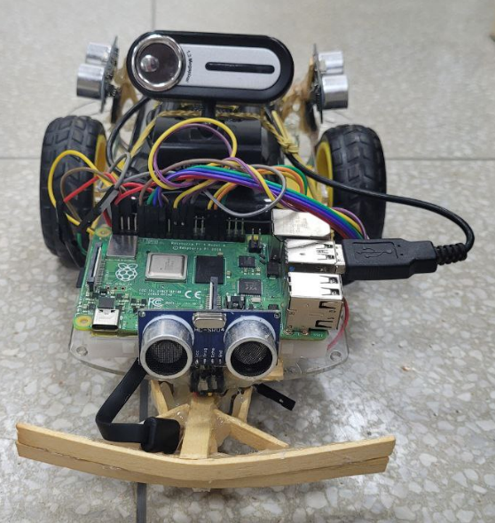
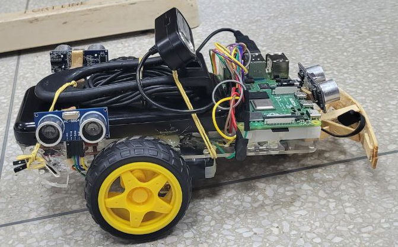
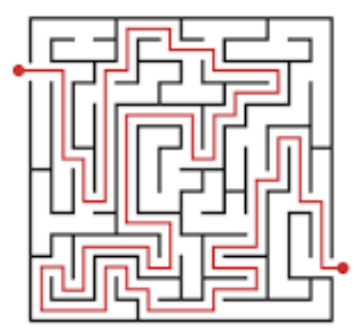

# pseudo-micromouse

Robô, inspirado no [MicroMouse](https://www.youtube.com/watch?v=ZMQbHMgK2rw) e realizado durante a disciplina [SISTEMAS OPERACIONAIS EMBARCADOS](https://github.com/diogoCaetanoGarcia/Sistemas_Embarcados), que busca por uma pessoa em um labirinto. Para isso, foi utilizado uma RaspberryPi, com 2 motores e sensores de ultrasom para medir a distancia até um obstáculo.

Como o labirinto é desconhecido, o algoritmo utilizado para a busca é a busca em profundidade em um mapa do labirinto que é construido de maneira dinamica, conforme o robô avança e verifica se nas posições adjacentes há uma parede ou um caminho livre por meio do ultrasom.

A identificação do objetivo é realizada por meio de uma webcam que tira fotos a cada iteração e utiliza o [YoloV4](https://docs.ultralytics.com/models/yolov4/) para o reconhecimento de pessoas. Quando uma pessoa é reconhecida, a busca foi concluída e as fotos tiradas no caminho são transformadas em um video e enviada para um grupo do Telegram.

